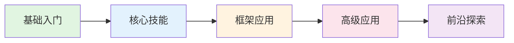

# Agent开发从入门到精通

<div align="center">

[](https://opensource.org/licenses/MIT)
[](https://github.com/luckyhlq/agent-dev-guide/stargazers)
[](https://github.com/luckyhlq/agent-dev-guide/network/members)

**系统学习AI Agent开发，从基础概念到生产部署的完整教程**

[在线阅读](https://agent.txyjr.site) | [GitHub仓库](https://github.com/luckyhlq/agent-dev-guide) | [问题反馈](https://github.com/luckyhlq/agent-dev-guide/issues)

</div>

---

## 📖 教程简介

本教程是一套系统化的AI Agent开发学习资料，从零基础到生产级应用，帮助你全面掌握Agent开发的核心技能。

### 🎯 适合人群

- **有开发经验的工程师**：熟悉Python编程，想系统学习Agent开发
- **AI应用开发者**：了解LLM基础，想深入Agent架构设计
- **技术决策者**：需要了解Agent技术栈，进行技术选型

### ✨ 教程特色

- 🎯 **系统化学习路径**：从基础概念到高级应用，循序渐进
- 💻 **理论与实践结合**：每个章节都包含理论讲解和实战项目
- 🔧 **主流框架覆盖**：深入讲解LangChain、CrewAI等主流框架
- 🚀 **生产级部署**：涵盖性能优化、监控告警、安全防护等生产环境必备知识
- 🤝 **多Agent协作**：深入探索多Agent系统的设计与实现
- 🔮 **前沿技术探索**：关注Agent领域的最新进展

---

## 🗺️ 学习路线



### 第一阶段：基础入门 🟢

- **第1章：Agent开发概述** - 了解Agent的定义、发展历程和应用场景
- **第2章：LLM基础与API使用** - 掌握OpenAI API的核心用法
- **第3章：Agent核心概念** - 理解Agent的基本架构和工作原理

### 第二阶段：核心技能 🔵

- **第4章：高级Prompt技术** - 掌握Prompt Engineering的核心技巧
- **第5章：Function Calling与工具使用** - 学会让Agent调用外部工具
- **第6章：记忆系统与向量数据库** - 构建Agent的记忆和知识库

### 第三阶段：框架应用 🟡

- **第7章：LangChain框架** - 深入学习最流行的Agent框架
- **第8章：CrewAI框架** - 掌握多Agent协作开发
- **第9章：其他主流框架** - 了解AutoGPT、LlamaIndex等框架

### 第四阶段：高级应用 🟠

- **第10章：Agent架构设计** - 学习复杂Agent系统的架构设计
- **第11章：多Agent协作** - 构建多Agent协作系统
- **第12章：生产部署** - 将Agent部署到生产环境

### 第五阶段：前沿探索 🔴

- **第13章：Agent评估与优化** - 评估和优化Agent性能
- **第14章：Agent安全与伦理** - 了解Agent的安全风险和伦理问题
- **第15章：自主Agent与未来趋势** - 探索Agent领域的最新进展
- **第16章：综合实战项目** - 完成一个完整的Agent项目

---

## 🛠️ 技术栈

| 类别 | 技术 |
|------|------|
| 编程语言 | Python 3.10+ |
| LLM服务 | OpenAI API (GPT-4) |
| Agent框架 | LangChain, CrewAI, AutoGPT |
| 向量数据库 | Chroma, Pinecone |
| 部署 | Docker, FastAPI, Nginx |

---

## 🚀 快速开始

### 在线阅读

直接访问 [https://agent.txyjr.site](https://agent.txyjr.site) 在线阅读教程。

### 本地运行

1. **克隆仓库**

```bash
git clone https://github.com/luckyhlq/agent-dev-guide.git
cd agent-dev-guide
```

2. **安装依赖**

```bash
npm install
```

3. **启动开发服务器**

```bash
npm run docs:dev
```

4. **访问本地网站**

打开浏览器访问 `http://localhost:5173`

---

## 📂 目录结构

```
agent-dev-guide/
├── docs/                    # 文档源文件
│   ├── foundation/          # 第一阶段：基础入门
│   │   ├── chapter1.md      # 第1章：Agent开发概述
│   │   ├── chapter2.md      # 第2章：LLM基础与API使用
│   │   └── chapter3.md      # 第3章：Agent核心概念
│   ├── core-skills/         # 第二阶段：核心技能
│   │   ├── chapter4.md      # 第4章：高级Prompt技术
│   │   ├── chapter5.md      # 第5章：Function Calling与工具使用
│   │   └── chapter6.md      # 第6章：记忆系统与向量数据库
│   ├── frameworks/          # 第三阶段：框架应用
│   │   ├── chapter7.md      # 第7章：LangChain框架
│   │   ├── chapter8.md      # 第8章：CrewAI框架
│   │   └── chapter9.md      # 第9章：其他主流框架
│   ├── advanced/            # 第四阶段：高级应用
│   │   ├── chapter10.md     # 第10章：Agent架构设计
│   │   ├── chapter11.md     # 第11章：多Agent协作
│   │   └── chapter12.md     # 第12章：生产部署
│   ├── frontier/            # 第五阶段：前沿探索
│   │   ├── chapter13.md     # 第13章：Agent评估与优化
│   │   ├── chapter14.md     # 第14章：Agent安全与伦理
│   │   ├── chapter15.md     # 第15章：自主Agent与未来趋势
│   │   └── chapter16.md     # 第16章：综合实战项目
│   ├── appendix/            # 附录
│   │   ├── appendix-a.md    # 附录A：常用工具与资源
│   │   ├── appendix-b.md    # 附录B：Prompt模板库
│   │   ├── appendix-c.md    # 附录C：代码仓库
│   │   ├── appendix-d.md    # 附录D：常见问题FAQ
│   │   └── appendix-e.md    # 附录E：社区与交流
│   ├── .vitepress/          # VitePress配置
│   └── index.md             # 首页
├── package.json             # 项目配置
└── README.md                # 项目说明
```

---

## 📚 学习建议

1. **按顺序学习**：章节之间有递进关系，建议按顺序学习
2. **动手实践**：每个实战项目都要亲自完成
3. **深入思考**：理解原理比记住代码更重要
4. **举一反三**：尝试修改示例代码，探索更多可能

---

## 🤝 参与贡献

欢迎提交Issue和Pull Request来完善本教程：

- 🐛 发现错误？提交 [Issue](https://github.com/luckyhlq/agent-dev-guide/issues)
- 💡 有好的建议？提交 [Pull Request](https://github.com/luckyhlq/agent-dev-guide/pulls)
- 📝 想分享经验？欢迎投稿

### 贡献指南

1. Fork 本仓库
2. 创建特性分支 (`git checkout -b feature/AmazingFeature`)
3. 提交更改 (`git commit -m 'Add some AmazingFeature'`)
4. 推送到分支 (`git push origin feature/AmazingFeature`)
5. 提交 Pull Request

---

## 📜 许可证

本教程基于 [MIT 许可证](https://opensource.org/licenses/MIT) 开源。

---

## 🙏 致谢

感谢以下开源项目和社区的支持：

- [LangChain](https://github.com/langchain-ai/langchain)
- [CrewAI](https://github.com/joaomdmoura/crewAI)
- [OpenAI](https://openai.com/)
- [VitePress](https://vitepress.dev/)

---

## 📮 联系方式

- **GitHub**: [https://github.com/luckyhlq/agent-dev-guide](https://github.com/luckyhlq/agent-dev-guide)
- **问题反馈**: [GitHub Issues](https://github.com/luckyhlq/agent-dev-guide/issues)

---

<div align="center">

**⭐ 如果这个教程对你有帮助，请给一个Star支持一下！⭐**

Made with ❤️ by luckyhlq

</div>
