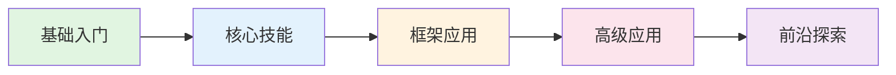

## 📚 教程特色

### 适合人群

- **有开发经验的工程师**：熟悉Python编程，想系统学习Agent开发
- **AI应用开发者**：了解LLM基础，想深入Agent架构设计
- **技术决策者**：需要了解Agent技术栈，进行技术选型

### 学习收获

完成本教程后，你将能够：

1. ✅ 理解Agent的核心原理和架构模式
2. ✅ 熟练使用OpenAI API和主流Agent框架
3. ✅ 设计和实现复杂的Agent系统
4. ✅ 构建多Agent协作应用
5. ✅ 将Agent部署到生产环境
6. ✅ 评估和优化Agent性能

## 🗺️ 学习路线

### 第一阶段：基础入门 🟢
- Agent开发概述
- LLM基础与API使用
- Agent核心概念

### 第二阶段：核心技能 🔵
- 高级Prompt技术
- Function Calling与工具使用
- 记忆系统与向量数据库

### 第三阶段：框架应用 🟡
- LangChain框架
- CrewAI框架
- 其他主流框架

### 第四阶段：高级应用 🟠
- Agent架构设计
- 多Agent协作
- 生产部署

### 第五阶段：前沿探索 🔴
- Agent评估与优化
- Agent安全与伦理
- 自主Agent与未来趋势

## 🛠️ 技术栈

本教程使用以下技术栈：

| 类别 | 技术 |
|------|------|
| 编程语言 | Python 3.10+ |
| LLM服务 | OpenAI API (GPT-4) |
| Agent框架 | LangChain, CrewAI, AutoGPT |
| 向量数据库 | Chroma, Pinecone |
| 部署 | Docker, FastAPI |

## 📖 如何使用本教程

1. **按顺序学习**：章节之间有递进关系，建议按顺序学习
2. **动手实践**：每个实战项目都要亲自完成
3. **深入思考**：理解原理比记住代码更重要
4. **举一反三**：尝试修改示例代码，探索更多可能

## 🤝 参与贡献

欢迎提交Issue和Pull Request来完善本教程：

- 发现错误？提交Issue
- 有好的建议？提交PR
- 想分享经验？欢迎投稿

## 📜 许可证

本教程基于 [MIT 许可证](https://opensource.org/licenses/MIT) 开源。

---

  <a href="/foundation/chapter1" style="display: inline-block; padding: 12px 24px; background: linear-gradient(120deg, #bd34fe 30%, #41d1ff); color: white; border-radius: 8px; text-decoration: none; font-weight: bold;">
    开始学习之旅 →
  </a>

